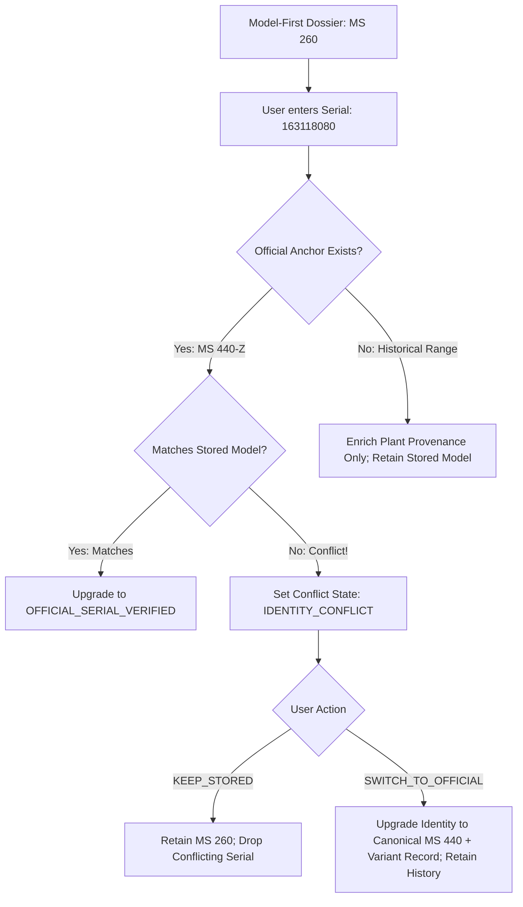

# PHASE 47 & 47A — MODEL-FIRST STIHL PASSPORT & PRIVACY/COMPATIBILITY HARDENING
**Status:** Completed, Hardened & Validated | **Branch:** `feat/model-first-passport-affiliate-foundation`

---

## 1. Executive Summary

Phase 47 and Phase 47A transform the STIHL Passport from a serial-dependent tool into a **model-first, universal machine passport and digital dossier architecture** with strict privacy, identity decoupling, and evidence-gated compatibility foundations.

### Core Achievements
1. **Model-First Passport:** Users can create and export a complete digital machine passport based solely on the machine model (`MODEL_ONLY` mode). The serial number is completely optional and can be enriched at any later time.
2. **Passport Multi-Mode Architecture:** Clear visual and structural distinction between:
   - `MODEL_ONLY` (Model identified, serial number optional / enrichable, factory/year unlinked, StopHeling box suppressed)
   - `MODEL_WITH_SERIAL` (Model + user/unanchored serial number, factory provenance resolved via canonical plant records)
   - `OFFICIAL_SERIAL_VERIFIED` (Official MY STIHL verified serial anchor, official variant and verification timestamp preserved)
3. **QR Privacy Hard Gate (Zero Serial Numbers to External Services):**
   - In all passport modes (`MODEL_ONLY`, `MODEL_WITH_SERIAL`, `OFFICIAL_SERIAL_VERIFIED`), the QR code target always points strictly to the public canonical model URL (`https://www.stihldecoder.nl/<category>/<model-slug>/`).
   - Serial numbers are **never** passed to `api.qrserver.com` or any external service.
4. **JS / TSX Parity:**
   - [`src/components/StihlPassportGenerator.js`](file:///C:/Users/GelliusSnippe/.agents/stihl-decoder/src/components/StihlPassportGenerator.js) and [`src/components/StihlPassportGenerator.tsx`](file:///C:/Users/GelliusSnippe/.agents/stihl-decoder/src/components/StihlPassportGenerator.tsx) are semantically identical.
   - Elimination of all hardcoded demonstration data (e.g. `26-08-2026`).
5. **Decoupled Canonical Model vs Official Product Variant:**
   - For official anchor serial `163118080`:
     - Canonical Identity: `model_slug = "ms-440"`, `model_name = "MS 440"`, `canonical_model_id = "stihl_ms_440"`.
     - Official Product Identity: `official_product_name = "MS 440-Z 3/8\" RIM Magnum Motorsäge"`, `verified_at = "2026-09-22"`.
   - On `SWITCH_TO_OFFICIAL` resolution, `model_name` remains `"MS 440"` and is never overwritten by the full variant string. All maintenance records, user notes, and reminders are preserved losslessly.
6. **Centralized Factory / Plant Resolution:**
   - Removed duplicate local `STIHL_PLANT_MAP` definitions.
   - Centralized plant resolution through exported `resolvePlantRecord(database, factoryDigit)` from [`src/decoder.js`](file:///C:/Users/GelliusSnippe/.agents/stihl-decoder/src/decoder.js). Passport components never self-derive plants from serial digits without verified decoder/database provenance.
7. **Compatibility Evidence Gates (Zero Unproven Claims):**
   - `VERIFIED_MODEL_COMPATIBILITY` strictly requires display-eligible documented evidence with reliable source status matching the exact canonical model scope.
   - Technical specifications without documented evidence yield `SPECIFICATION_MATCH_ONLY`.
   - Partial chain specs (pitch + gauge without drive link count or official part record) yield `SPECIFICATION_MATCH_ONLY` with cautious guidance.
   - Universal claims sanitized: generic chain oil is described as "Kettingolie voor kettingzaagtoepassingen", and 2-stroke oil advises checking model-specific fuel mix ratio.
   - Commercial layer remains completely inert: `offers: []`, `offers_active: false`, zero merchant URLs or affiliate links.
8. **Strict Privacy Analytics:**
   - Serial numbers, user nicknames, and personal notes are strictly blocked from analytics telemetry via explicit metadata whitelisting.

---

## 2. Architecture & Dossier Schema

### 2.1 Machine Dossier Schema (v2.0.0)
The schema explicitly supports nullable serial numbers and decoupled identity tracking:

```json
{
  "dossier_id": "dossier_ms_440_1727196000000",
  "schema_version": "2.0.0",
  "created_at": "2026-09-24T16:40:00.000Z",
  "updated_at": "2026-09-24T16:40:00.000Z",
  "model_slug": "ms-440",
  "model_name": "MS 440",
  "canonical_model_id": "stihl_ms_440",
  "official_product_name": null,
  "serial_number": null,
  "passport_mode": "MODEL_ONLY",
  "serial_resolution": null,
  "official_anchor": null,
  "maintenance_events": [],
  "user_notes": []
}
```

### 2.2 V1 -> V2 Transactional Migration
Existing stored dossiers (v1.0.0) lacking `passport_mode` or schema versioning are safely migrated in memory upon load:
- If `serial_number` is missing or null: assigned `passport_mode = "MODEL_ONLY"`.
- If `serial_number` is present and matches an official anchor: assigned `passport_mode = "OFFICIAL_SERIAL_VERIFIED"`, `official_anchor` populated with provenance.
- If `serial_number` is present without official anchor: assigned `passport_mode = "MODEL_WITH_SERIAL"`.
- All maintenance history, custom notes, and timestamps are preserved 100% losslessly.

---

## 3. Passport Modes & UI Matrix

| Feature / Attribute | `MODEL_ONLY` | `MODEL_WITH_SERIAL` | `OFFICIAL_SERIAL_VERIFIED` |
|---|---|---|---|
| **Identity Header** | Canonical Model (`MS 440`) | Canonical Model (`MS 440`) | Canonical Model (`MS 440`) + Verified Variant Subtitle |
| **Serial Badge** | `Nog niet toegevoegd` (gestreept kader) | Serial number displayed + Factory plant | Serial number displayed + `✓ Officieel STIHL` |
| **Herkomst / Fabriek** | "Nog niet gekoppeld (geen serienummer)" | Resolved via canonical `resolvePlantRecord` | Resolved via canonical `resolvePlantRecord` |
| **Bouwjaar** | "Niet opgegeven" (tenzij gebruiker aankoopjaar invoert) | Afgeleid uit decoder productiechronologie | Afgeleid uit officiële anchor / chronologie |
| **StopHeling Blok** | **Onderdrukt** (geen StopHeling zonder serienummer) | Actieve statusweergave | Actieve statusweergave |
| **QR Code Doel** | Canonical modelpagina (`/kettingzagen/ms-440/`) | Canonical modelpagina (`/kettingzagen/ms-440/`) | Canonical modelpagina (`/kettingzagen/ms-440/`) |
| **Externe QR Request** | **Geen serienummer** (`api.qrserver.com` ontvangt enkel model-URL) | **Geen serienummer** (`api.qrserver.com` ontvangt enkel model-URL) | **Geen serienummer** (`api.qrserver.com` ontvangt enkel model-URL) |
| **Aanbevelingsslots** | Actief op basis van modelvereisten | Actief op basis van modelvereisten | Actief op basis van modelvereisten |

---

## 4. Serial Enrichment & Conflict Resolution



### 4.1 Canonical Model vs Official Variant on SWITCH_TO_OFFICIAL
When resolving an `IDENTITY_CONFLICT` via `SWITCH_TO_OFFICIAL`:
- `target.identity.model_slug = "ms-440"`
- `target.identity.model_name = "MS 440"` (Canonical base model name from database)
- `target.identity.canonical_model_id = "stihl_ms_440"`
- `target.identity.official_product_name = "MS 440-Z 3/8\" RIM Magnum Motorsäge"`
- `target.identity.verified_at = "2026-09-22"`
- `target.machine.serial_number = "163118080"`
- All existing maintenance events, user notes, and reminders are preserved without data loss.

---

## 5. Affiliate Foundation & Privacy Architecture

### 5.1 3-Layer Decoupled Architecture
```
+---------------------------------------------------------------------------------+
| LAYER 1: Canonical Machine Specs & Part Requirements (Database)                |
| - displacement, chain_pitch, chain_gauge, spark_plug, file_size                |
+---------------------------------------------------------------------------------+
                                         │
                                         ▼
+---------------------------------------------------------------------------------+
| LAYER 2: Generic Recommendation Slots (modelRecommendations.js)                 |
| - Status hierarchy:                                                            |
|   * VERIFIED_MODEL_COMPATIBILITY (Requires eligible documented evidence)       |
|   * SPECIFICATION_MATCH_ONLY (Partial specs or specs without evidence)         |
|   * GENERIC_CATEGORY_RECOMMENDATION (Category-wide maintenance guidance)        |
|   * UNVERIFIED (Missing technical specifications)                               |
|   * CONFLICTED (Incompatible configuration)                                    |
| - offers: [] (Strictly empty array)                                             |
+---------------------------------------------------------------------------------+
                                         │
                                         ▼
+---------------------------------------------------------------------------------+
| LAYER 3: Commercial & Merchant Layer (Future / Inactive)                        |
| - offers_active: false                                                          |
| - Zero mock URLs, zero fictional pricing, zero affiliate cookies                |
+---------------------------------------------------------------------------------+
```

### 5.2 Compatibility Evidence Gates Matrix

| Recommendation Type | Input Conditions | Required Evidence | Resulting Status & Display Guidance |
|---|---|---|---|
| **Bougie** | `spark_plug: 'Bosch WSR6F'` | None | `SPECIFICATION_MATCH_ONLY` ("Specificatiematch op basis van technische gegevens") |
| **Bougie** | `spark_plug: 'Bosch WSR6F'` | `display_eligible: true`, `OFFICIAL_DOCUMENTED` | `VERIFIED_MODEL_COMPATIBILITY` ("Geschikt voor jouw STIHL MS 440") |
| **Zaagketting** | `pitch: '3/8"'`, `gauge: '1.6'` | None / Missing drive links | `SPECIFICATION_MATCH_ONLY` ("Steek en dikte komen overeen; controleer aantal aandrijfschakels...") |
| **Zaagketting** | `pitch`, `gauge`, `drive_links: 72` | `display_eligible: true`, `OFFICIAL_DOCUMENTED` | `VERIFIED_MODEL_COMPATIBILITY` ("Geschikt voor jouw STIHL MS 440") |
| **Kettingolie** | Chainsaw category | Category standard | `GENERIC_CATEGORY_RECOMMENDATION` ("Kettingolie voor kettingzaagtoepassingen") |
| **2-Takt Olie** | Combustion category | Standard operating procedure | `GENERIC_CATEGORY_RECOMMENDATION` ("Controleer de voorgeschreven brandstof/mengverhouding...") |

### 5.3 Strict Analytics Privacy Policy
In compliance with user data protection policies:
- Serial numbers, user nicknames, and custom notes are strictly filtered from analytics payloads.
- Whitelisted event keys: `model_slug`, `model_name`, `passport_mode`, `conflict_type`, `resolution_strategy`, `slot_category`, `compatibility_status`.

---

## 6. Test Suite & Verification Results

All 12 production test suites in the canonical production runner pass 100% cleanly:

| Suite Name | Tests / Scope | Status | Duration |
|---|---|---|---|
| `official_serial_anchor_and_range_semantics.test.js` | Official anchors & fail-closed historical ranges | ✅ PASS | 283ms |
| `serial_decoder_recovery_current.test.js` | Serial decoder recovery, plant mapping, fallback checks | ✅ PASS | 403ms |
| `baseline.test.js` | Core classification & engine baseline regression | ✅ PASS | 567ms |
| `canonical_policy.test.js` | Canonical URL and SEO policy enforcement | ✅ PASS | 169ms |
| `phase36_serial_user_value_engine.test.js` | Value estimation and user guidance engine | ✅ PASS | 232ms |
| `render_www_alignment.test.js` | WWW routes and SSR template validation | ✅ PASS | 937ms |
| `production_validation.test.js` | SEO topical authority, sitemap integrity, 0 errors | ✅ PASS | 3235ms |
| `decoder.test.js` | SSR pilot pages and schema graphs | ✅ PASS | 294ms |
| `model_first_passport.test.js` | Model-first dossiers, null serials, V1->V2 migration, CTA | ✅ PASS | 236ms |
| `passport_serial_enrichment.test.js` | Serial enrichment, conflict detection, KEEP/SWITCH strategies | ✅ PASS | 294ms |
| `affiliate_foundation.test.js` | 3-layer recommendation schema, Gates A-F, privacy tracker | ✅ PASS | 287ms |
| `passport_hardening.test.js` | Phase 47A QR privacy, JS/TSX parity, identity decoupling | ✅ PASS | 342ms |
| **Total** | **12 Suites / 100+ Assertions** | **✅ 100% PASS** | **~7.3s** |

---

## 7. Modified & Created Files Summary

- [`src/decoder.js`](file:///C:/Users/GelliusSnippe/.agents/stihl-decoder/src/decoder.js): Exported `resolvePlantRecord(database, factoryDigit)` for centralized plant mapping.
- [`src/components/MachineDossierManager.js`](file:///C:/Users/GelliusSnippe/.agents/stihl-decoder/src/components/MachineDossierManager.js): Centralized plant resolution; decoupled canonical model (`model_name`) from official product variant (`official_product_name`) in conflict resolution.
- [`src/components/StihlPassportGenerator.js`](file:///C:/Users/GelliusSnippe/.agents/stihl-decoder/src/components/StihlPassportGenerator.js): Enforced QR privacy (canonical model URL without serial parameters); centralized plant resolution; supported `MODEL_ONLY` fallback semantics.
- [`src/components/StihlPassportGenerator.tsx`](file:///C:/Users/GelliusSnippe/.agents/stihl-decoder/src/components/StihlPassportGenerator.tsx): Full semantic parity with JS implementation; removed fake demonstration dates; suppressed StopHeling box on `MODEL_ONLY`.
- [`src/modelRecommendations.js`](file:///C:/Users/GelliusSnippe/.agents/stihl-decoder/src/modelRecommendations.js): Implemented `findEligibleEvidence` gate for `VERIFIED_MODEL_COMPATIBILITY`; enforced full chain configuration gate; sanitized generic claims.
- [`tests/passport_hardening.test.js`](file:///C:/Users/GelliusSnippe/.agents/stihl-decoder/tests/passport_hardening.test.js): New dedicated Phase 47A test suite testing QR privacy, parity, identity decoupling, and privacy.
- [`tests/affiliate_foundation.test.js`](file:///C:/Users/GelliusSnippe/.agents/stihl-decoder/tests/affiliate_foundation.test.js): Upgraded Test 3 to verify Gates A-F.
- [`tests/passport_serial_enrichment.test.js`](file:///C:/Users/GelliusSnippe/.agents/stihl-decoder/tests/passport_serial_enrichment.test.js): Updated Test K to verify canonical `model_name = "MS 440"` vs `official_product_name`.
- [`tests/run_current_production_tests.js`](file:///C:/Users/GelliusSnippe/.agents/stihl-decoder/tests/run_current_production_tests.js): Added `passport_hardening.test.js` to canonical production test runner.
